<h1>Table of Contents<span class="tocSkip"></span></h1>
<div class="toc"><ul class="toc-item"><li><span><a href="#Imports" data-toc-modified-id="Imports-1"><span class="toc-item-num">1&nbsp;&nbsp;</span>Imports</a></span></li><li><span><a href="#Data-Collection" data-toc-modified-id="Data-Collection-2"><span class="toc-item-num">2&nbsp;&nbsp;</span>Data Collection</a></span></li><li><span><a href="#EDA" data-toc-modified-id="EDA-3"><span class="toc-item-num">3&nbsp;&nbsp;</span>EDA</a></span><ul class="toc-item"><li><span><a href="#Understanding-and-Plotting-Value" data-toc-modified-id="Understanding-and-Plotting-Value-3.1"><span class="toc-item-num">3.1&nbsp;&nbsp;</span>Understanding and Plotting Value</a></span></li><li><span><a href="#WordCloud-with-Title-values" data-toc-modified-id="WordCloud-with-Title-values-3.2"><span class="toc-item-num">3.2&nbsp;&nbsp;</span>WordCloud with Title values</a></span></li></ul></li><li><span><a href="#Data-Prep" data-toc-modified-id="Data-Prep-4"><span class="toc-item-num">4&nbsp;&nbsp;</span>Data Prep</a></span></li><li><span><a href="#Modeling" data-toc-modified-id="Modeling-5"><span class="toc-item-num">5&nbsp;&nbsp;</span>Modeling</a></span><ul class="toc-item"><li><ul class="toc-item"><li><span><a href="#Train-Test-Split" data-toc-modified-id="Train-Test-Split-5.0.1"><span class="toc-item-num">5.0.1&nbsp;&nbsp;</span>Train Test Split</a></span></li><li><span><a href="#Smote" data-toc-modified-id="Smote-5.0.2"><span class="toc-item-num">5.0.2&nbsp;&nbsp;</span>Smote</a></span></li></ul></li><li><span><a href="#Baseline-Model" data-toc-modified-id="Baseline-Model-5.1"><span class="toc-item-num">5.1&nbsp;&nbsp;</span>Baseline Model</a></span></li><li><span><a href="#Basic-Logistic-Regression" data-toc-modified-id="Basic-Logistic-Regression-5.2"><span class="toc-item-num">5.2&nbsp;&nbsp;</span>Basic Logistic Regression</a></span><ul class="toc-item"><li><span><a href="#MinMax-Scaler" data-toc-modified-id="MinMax-Scaler-5.2.1"><span class="toc-item-num">5.2.1&nbsp;&nbsp;</span>MinMax Scaler</a></span></li><li><span><a href="#StandardScaler" data-toc-modified-id="StandardScaler-5.2.2"><span class="toc-item-num">5.2.2&nbsp;&nbsp;</span>StandardScaler</a></span></li></ul></li><li><span><a href="#KNeighbors-Classifier" data-toc-modified-id="KNeighbors-Classifier-5.3"><span class="toc-item-num">5.3&nbsp;&nbsp;</span>KNeighbors Classifier</a></span><ul class="toc-item"><li><span><a href="#MinMax-Scaler" data-toc-modified-id="MinMax-Scaler-5.3.1"><span class="toc-item-num">5.3.1&nbsp;&nbsp;</span>MinMax Scaler</a></span></li><li><span><a href="#Standard-Scaler" data-toc-modified-id="Standard-Scaler-5.3.2"><span class="toc-item-num">5.3.2&nbsp;&nbsp;</span>Standard Scaler</a></span></li></ul></li><li><span><a href="#Bagging" data-toc-modified-id="Bagging-5.4"><span class="toc-item-num">5.4&nbsp;&nbsp;</span>Bagging</a></span><ul class="toc-item"><li><span><a href="#Min-Man-Scaler" data-toc-modified-id="Min-Man-Scaler-5.4.1"><span class="toc-item-num">5.4.1&nbsp;&nbsp;</span>Min Man Scaler</a></span></li><li><span><a href="#Standard-Scaler" data-toc-modified-id="Standard-Scaler-5.4.2"><span class="toc-item-num">5.4.2&nbsp;&nbsp;</span>Standard Scaler</a></span></li></ul></li><li><span><a href="#XGBOOST" data-toc-modified-id="XGBOOST-5.5"><span class="toc-item-num">5.5&nbsp;&nbsp;</span>XGBOOST</a></span><ul class="toc-item"><li><span><a href="#MinMax-Scaler" data-toc-modified-id="MinMax-Scaler-5.5.1"><span class="toc-item-num">5.5.1&nbsp;&nbsp;</span>MinMax Scaler</a></span></li><li><span><a href="#Standard" data-toc-modified-id="Standard-5.5.2"><span class="toc-item-num">5.5.2&nbsp;&nbsp;</span>Standard</a></span></li></ul></li><li><span><a href="#Random-Forrest" data-toc-modified-id="Random-Forrest-5.6"><span class="toc-item-num">5.6&nbsp;&nbsp;</span>Random Forrest</a></span><ul class="toc-item"><li><span><a href="#MinMax-Scaler" data-toc-modified-id="MinMax-Scaler-5.6.1"><span class="toc-item-num">5.6.1&nbsp;&nbsp;</span>MinMax Scaler</a></span></li><li><span><a href="#Standard-Scaler" data-toc-modified-id="Standard-Scaler-5.6.2"><span class="toc-item-num">5.6.2&nbsp;&nbsp;</span>Standard Scaler</a></span></li></ul></li></ul></li></ul></div>

# Imports


```python
#DataFrame
import pandas as pd
pd.set_option('display.max_columns', None)

# Matplot
import matplotlib.pyplot as plt
%matplotlib inline

#Utility
from collections import Counter
import re
import datetime
import time

# WordCloud
from wordcloud import WordCloud, STOPWORDS

#Imblearn
from imblearn.over_sampling import SMOTE

#NLTK
from nltk.corpus import stopwords
from  nltk.stem import SnowballStemmer
from nltk.probability import FreqDist
from nltk.tokenize import word_tokenize

#Keras
from keras.preprocessing.text import Tokenizer
from keras.preprocessing.sequence import pad_sequences

# Scikit-learn
from sklearn.model_selection import train_test_split
from sklearn.linear_model import LogisticRegression
from sklearn import preprocessing
from sklearn.dummy import DummyClassifier
from sklearn.metrics import accuracy_score, f1_score, recall_score, precision_score
from sklearn.preprocessing import MinMaxScaler
from sklearn.preprocessing import StandardScaler
from sklearn.linear_model import Lasso, Ridge
from sklearn.model_selection import GridSearchCV
from sklearn.metrics import confusion_matrix
from sklearn.metrics import plot_confusion_matrix
from sklearn.neighbors import KNeighborsClassifier 
from sklearn.ensemble import BaggingClassifier 
from sklearn.ensemble import RandomForestClassifier 

# XGBOSST model
import xgboost as xgb
```


# Data Collection


```python
#Data obtained from Congressional Bills Project. 
#http://congressionalbills.org
df = pd.read_csv('bills115-16partialAug92020.csv', encoding='latin1')
```


```python
df.head(10)
```


<div>
<style scoped>
    .dataframe tbody tr th:only-of-type {
        vertical-align: middle;
    }

    .dataframe tbody tr th {
        vertical-align: top;
    }

    .dataframe thead th {
        text-align: right;
    }
</style>
<table border="1" class="dataframe">
  <thead>
    <tr style="text-align: right;">
      <th></th>
      <th>BillID</th>
      <th>BillNum</th>
      <th>BillType</th>
      <th>Chamber</th>
      <th>congress</th>
      <th>Cosponsr</th>
      <th>IntrDate</th>
      <th>Mult</th>
      <th>MultNo</th>
      <th>PLaw</th>
      <th>Private</th>
      <th>Title</th>
      <th>desig</th>
      <th>Veto</th>
      <th>Class</th>
      <th>ComC</th>
      <th>ComR</th>
      <th>CumHServ</th>
      <th>CumSServ</th>
      <th>Delegate</th>
      <th>District</th>
      <th>DW1</th>
      <th>FrstConH</th>
      <th>FrstConS</th>
      <th>Gender</th>
      <th>MemberID</th>
      <th>Mref</th>
      <th>NameFirst</th>
      <th>NameFull</th>
      <th>NameLast</th>
      <th>Party</th>
      <th>PooleID</th>
      <th>Postal</th>
      <th>State</th>
      <th>URL</th>
      <th>ChRef</th>
      <th>RankRef</th>
      <th>PassH</th>
      <th>PassS</th>
      <th>PLawDate</th>
      <th>PLawNum</th>
      <th>ImpBill</th>
      <th>SubChRef</th>
      <th>SubRankRef</th>
      <th>Majority</th>
      <th>ReportH</th>
      <th>ReportS</th>
      <th>Major</th>
      <th>Minor</th>
      <th>icpsr</th>
      <th>nominate_dim1</th>
      <th>state_abbrev</th>
      <th>district_code</th>
      <th>state_icpsr</th>
      <th>bioguide_id</th>
    </tr>
  </thead>
  <tbody>
    <tr>
      <th>0</th>
      <td>115-hjres-95</td>
      <td>95</td>
      <td>hjres</td>
      <td>False</td>
      <td>115</td>
      <td>9</td>
      <td>4/6/2017</td>
      <td>False</td>
      <td>1</td>
      <td>False</td>
      <td>NaN</td>
      <td>Expressing support for designation of Septembe...</td>
      <td>1</td>
      <td>False</td>
      <td>NaN</td>
      <td>NaN</td>
      <td>NaN</td>
      <td>NaN</td>
      <td>NaN</td>
      <td>0</td>
      <td>NaN</td>
      <td>NaN</td>
      <td>NaN</td>
      <td>NaN</td>
      <td>1</td>
      <td>29573-115-100</td>
      <td>NaN</td>
      <td>Sheila</td>
      <td>Jackson Lee, Sheila</td>
      <td>Jackson Lee</td>
      <td>100.0</td>
      <td>NaN</td>
      <td>NaN</td>
      <td>NaN</td>
      <td>NaN</td>
      <td>NaN</td>
      <td>NaN</td>
      <td>False</td>
      <td>False</td>
      <td>NaN</td>
      <td>NaN</td>
      <td>0</td>
      <td>NaN</td>
      <td>NaN</td>
      <td>0.0</td>
      <td>False</td>
      <td>False</td>
      <td>20</td>
      <td>2008</td>
      <td>29573.0</td>
      <td>-0.460</td>
      <td>TX</td>
      <td>18.0</td>
      <td>49.0</td>
      <td>J000032</td>
    </tr>
    <tr>
      <th>1</th>
      <td>115-hjres-139</td>
      <td>139</td>
      <td>hjres</td>
      <td>False</td>
      <td>115</td>
      <td>3</td>
      <td>9/12/2018</td>
      <td>False</td>
      <td>1</td>
      <td>False</td>
      <td>NaN</td>
      <td>Providing for the designation of a "Freedom to...</td>
      <td>1</td>
      <td>False</td>
      <td>NaN</td>
      <td>NaN</td>
      <td>NaN</td>
      <td>NaN</td>
      <td>NaN</td>
      <td>0</td>
      <td>NaN</td>
      <td>NaN</td>
      <td>NaN</td>
      <td>NaN</td>
      <td>1</td>
      <td>15029-115-100</td>
      <td>NaN</td>
      <td>Marcy</td>
      <td>Kaptur, Marcy</td>
      <td>Kaptur</td>
      <td>100.0</td>
      <td>NaN</td>
      <td>NaN</td>
      <td>NaN</td>
      <td>NaN</td>
      <td>NaN</td>
      <td>NaN</td>
      <td>False</td>
      <td>False</td>
      <td>NaN</td>
      <td>NaN</td>
      <td>0</td>
      <td>NaN</td>
      <td>NaN</td>
      <td>0.0</td>
      <td>False</td>
      <td>False</td>
      <td>21</td>
      <td>2101</td>
      <td>15029.0</td>
      <td>-0.350</td>
      <td>OH</td>
      <td>9.0</td>
      <td>24.0</td>
      <td>K000009</td>
    </tr>
    <tr>
      <th>2</th>
      <td>115-hr-267</td>
      <td>267</td>
      <td>hr</td>
      <td>False</td>
      <td>115</td>
      <td>30</td>
      <td>1/4/2017</td>
      <td>False</td>
      <td>1</td>
      <td>True</td>
      <td>NaN</td>
      <td>To redesignate the Martin Luther King, Junior,...</td>
      <td>1</td>
      <td>False</td>
      <td>NaN</td>
      <td>NaN</td>
      <td>NaN</td>
      <td>NaN</td>
      <td>NaN</td>
      <td>0</td>
      <td>NaN</td>
      <td>NaN</td>
      <td>NaN</td>
      <td>NaN</td>
      <td>0</td>
      <td>15431-115-100</td>
      <td>NaN</td>
      <td>John</td>
      <td>Lewis, John</td>
      <td>Lewis</td>
      <td>100.0</td>
      <td>NaN</td>
      <td>NaN</td>
      <td>NaN</td>
      <td>NaN</td>
      <td>NaN</td>
      <td>NaN</td>
      <td>True</td>
      <td>False</td>
      <td>1/8/2018</td>
      <td>115-108</td>
      <td>0</td>
      <td>NaN</td>
      <td>NaN</td>
      <td>0.0</td>
      <td>False</td>
      <td>True</td>
      <td>21</td>
      <td>2101</td>
      <td>15431.0</td>
      <td>-0.589</td>
      <td>GA</td>
      <td>5.0</td>
      <td>44.0</td>
      <td>L000287</td>
    </tr>
    <tr>
      <th>3</th>
      <td>115-hr-294</td>
      <td>294</td>
      <td>hr</td>
      <td>False</td>
      <td>115</td>
      <td>35</td>
      <td>1/5/2017</td>
      <td>False</td>
      <td>1</td>
      <td>True</td>
      <td>NaN</td>
      <td>To designate the facility of the United States...</td>
      <td>1</td>
      <td>False</td>
      <td>NaN</td>
      <td>NaN</td>
      <td>NaN</td>
      <td>NaN</td>
      <td>NaN</td>
      <td>0</td>
      <td>NaN</td>
      <td>NaN</td>
      <td>NaN</td>
      <td>NaN</td>
      <td>0</td>
      <td>20948-115-200</td>
      <td>NaN</td>
      <td>Pete</td>
      <td>Olson, Pete</td>
      <td>Olson</td>
      <td>200.0</td>
      <td>NaN</td>
      <td>NaN</td>
      <td>NaN</td>
      <td>NaN</td>
      <td>NaN</td>
      <td>NaN</td>
      <td>True</td>
      <td>False</td>
      <td>3/16/2018</td>
      <td>115-133</td>
      <td>0</td>
      <td>NaN</td>
      <td>NaN</td>
      <td>1.0</td>
      <td>False</td>
      <td>True</td>
      <td>20</td>
      <td>2008</td>
      <td>20948.0</td>
      <td>0.548</td>
      <td>TX</td>
      <td>22.0</td>
      <td>49.0</td>
      <td>O000168</td>
    </tr>
    <tr>
      <th>4</th>
      <td>115-hr-360</td>
      <td>360</td>
      <td>hr</td>
      <td>False</td>
      <td>115</td>
      <td>13</td>
      <td>1/6/2017</td>
      <td>False</td>
      <td>1</td>
      <td>False</td>
      <td>NaN</td>
      <td>To designate the Greater Grand Canyon Heritage...</td>
      <td>1</td>
      <td>False</td>
      <td>NaN</td>
      <td>NaN</td>
      <td>NaN</td>
      <td>NaN</td>
      <td>NaN</td>
      <td>0</td>
      <td>NaN</td>
      <td>NaN</td>
      <td>NaN</td>
      <td>NaN</td>
      <td>0</td>
      <td>20305-115-100</td>
      <td>NaN</td>
      <td>Raul</td>
      <td>Grijalva, Raul M.</td>
      <td>Grijalva</td>
      <td>100.0</td>
      <td>NaN</td>
      <td>NaN</td>
      <td>NaN</td>
      <td>NaN</td>
      <td>NaN</td>
      <td>NaN</td>
      <td>False</td>
      <td>False</td>
      <td>NaN</td>
      <td>NaN</td>
      <td>0</td>
      <td>NaN</td>
      <td>NaN</td>
      <td>0.0</td>
      <td>False</td>
      <td>False</td>
      <td>21</td>
      <td>2101</td>
      <td>20305.0</td>
      <td>-0.599</td>
      <td>AZ</td>
      <td>3.0</td>
      <td>61.0</td>
      <td>G000551</td>
    </tr>
    <tr>
      <th>5</th>
      <td>115-hr-375</td>
      <td>375</td>
      <td>hr</td>
      <td>False</td>
      <td>115</td>
      <td>8</td>
      <td>1/9/2017</td>
      <td>False</td>
      <td>1</td>
      <td>True</td>
      <td>NaN</td>
      <td>To designate the Federal building and United S...</td>
      <td>1</td>
      <td>False</td>
      <td>NaN</td>
      <td>NaN</td>
      <td>NaN</td>
      <td>NaN</td>
      <td>NaN</td>
      <td>0</td>
      <td>NaN</td>
      <td>NaN</td>
      <td>NaN</td>
      <td>NaN</td>
      <td>1</td>
      <td>20351-115-200</td>
      <td>NaN</td>
      <td>Marsha</td>
      <td>Blackburn, Marsha</td>
      <td>Blackburn</td>
      <td>200.0</td>
      <td>NaN</td>
      <td>NaN</td>
      <td>NaN</td>
      <td>NaN</td>
      <td>NaN</td>
      <td>NaN</td>
      <td>True</td>
      <td>False</td>
      <td>6/6/2017</td>
      <td>115-39</td>
      <td>0</td>
      <td>NaN</td>
      <td>NaN</td>
      <td>1.0</td>
      <td>True</td>
      <td>False</td>
      <td>20</td>
      <td>2008</td>
      <td>20351.0</td>
      <td>0.618</td>
      <td>TN</td>
      <td>7.0</td>
      <td>54.0</td>
      <td>B001243</td>
    </tr>
    <tr>
      <th>6</th>
      <td>115-hr-381</td>
      <td>381</td>
      <td>hr</td>
      <td>False</td>
      <td>115</td>
      <td>45</td>
      <td>1/9/2017</td>
      <td>False</td>
      <td>1</td>
      <td>True</td>
      <td>NaN</td>
      <td>To designate a mountain in the John Muir Wilde...</td>
      <td>1</td>
      <td>False</td>
      <td>NaN</td>
      <td>NaN</td>
      <td>NaN</td>
      <td>NaN</td>
      <td>NaN</td>
      <td>0</td>
      <td>NaN</td>
      <td>NaN</td>
      <td>NaN</td>
      <td>NaN</td>
      <td>0</td>
      <td>20903-115-200</td>
      <td>NaN</td>
      <td>Tom</td>
      <td>McClintock, Tom</td>
      <td>McClintock</td>
      <td>200.0</td>
      <td>NaN</td>
      <td>NaN</td>
      <td>NaN</td>
      <td>NaN</td>
      <td>NaN</td>
      <td>NaN</td>
      <td>True</td>
      <td>False</td>
      <td>1/10/2018</td>
      <td>115-109</td>
      <td>0</td>
      <td>NaN</td>
      <td>NaN</td>
      <td>1.0</td>
      <td>False</td>
      <td>True</td>
      <td>21</td>
      <td>2103</td>
      <td>20903.0</td>
      <td>0.720</td>
      <td>CA</td>
      <td>4.0</td>
      <td>71.0</td>
      <td>M001177</td>
    </tr>
    <tr>
      <th>7</th>
      <td>115-hr-382</td>
      <td>382</td>
      <td>hr</td>
      <td>False</td>
      <td>115</td>
      <td>2</td>
      <td>1/9/2017</td>
      <td>False</td>
      <td>1</td>
      <td>False</td>
      <td>NaN</td>
      <td>To amend the Department of Agriculture program...</td>
      <td>1</td>
      <td>False</td>
      <td>NaN</td>
      <td>NaN</td>
      <td>NaN</td>
      <td>NaN</td>
      <td>NaN</td>
      <td>0</td>
      <td>NaN</td>
      <td>NaN</td>
      <td>NaN</td>
      <td>NaN</td>
      <td>1</td>
      <td>21342-115-100</td>
      <td>NaN</td>
      <td>Grace</td>
      <td>Meng, Grace</td>
      <td>Meng</td>
      <td>100.0</td>
      <td>NaN</td>
      <td>NaN</td>
      <td>NaN</td>
      <td>NaN</td>
      <td>NaN</td>
      <td>NaN</td>
      <td>True</td>
      <td>False</td>
      <td>NaN</td>
      <td>NaN</td>
      <td>0</td>
      <td>NaN</td>
      <td>NaN</td>
      <td>0.0</td>
      <td>False</td>
      <td>False</td>
      <td>6</td>
      <td>607</td>
      <td>21342.0</td>
      <td>-0.378</td>
      <td>NY</td>
      <td>6.0</td>
      <td>13.0</td>
      <td>M001188</td>
    </tr>
    <tr>
      <th>8</th>
      <td>115-hr-401</td>
      <td>401</td>
      <td>hr</td>
      <td>False</td>
      <td>115</td>
      <td>0</td>
      <td>1/10/2017</td>
      <td>False</td>
      <td>1</td>
      <td>False</td>
      <td>NaN</td>
      <td>To designate the mountain at the Devils Tower ...</td>
      <td>1</td>
      <td>False</td>
      <td>NaN</td>
      <td>NaN</td>
      <td>NaN</td>
      <td>NaN</td>
      <td>NaN</td>
      <td>0</td>
      <td>NaN</td>
      <td>NaN</td>
      <td>NaN</td>
      <td>NaN</td>
      <td>1</td>
      <td>21710-115-200</td>
      <td>NaN</td>
      <td>Liz</td>
      <td>Cheney, Liz</td>
      <td>Cheney</td>
      <td>200.0</td>
      <td>NaN</td>
      <td>NaN</td>
      <td>NaN</td>
      <td>NaN</td>
      <td>NaN</td>
      <td>NaN</td>
      <td>False</td>
      <td>False</td>
      <td>NaN</td>
      <td>NaN</td>
      <td>0</td>
      <td>NaN</td>
      <td>NaN</td>
      <td>1.0</td>
      <td>True</td>
      <td>False</td>
      <td>21</td>
      <td>2101</td>
      <td>21710.0</td>
      <td>0.509</td>
      <td>WY</td>
      <td>1.0</td>
      <td>68.0</td>
      <td>C001109</td>
    </tr>
    <tr>
      <th>9</th>
      <td>115-hr-443</td>
      <td>443</td>
      <td>hr</td>
      <td>False</td>
      <td>115</td>
      <td>1</td>
      <td>1/11/2017</td>
      <td>False</td>
      <td>1</td>
      <td>False</td>
      <td>NaN</td>
      <td>To direct the Secretary of the Interior to stu...</td>
      <td>1</td>
      <td>False</td>
      <td>NaN</td>
      <td>NaN</td>
      <td>NaN</td>
      <td>NaN</td>
      <td>NaN</td>
      <td>0</td>
      <td>NaN</td>
      <td>NaN</td>
      <td>NaN</td>
      <td>NaN</td>
      <td>0</td>
      <td>21179-115-200</td>
      <td>NaN</td>
      <td>Scott</td>
      <td>DesJarlais, Scott</td>
      <td>DesJarlais</td>
      <td>200.0</td>
      <td>NaN</td>
      <td>NaN</td>
      <td>NaN</td>
      <td>NaN</td>
      <td>NaN</td>
      <td>NaN</td>
      <td>True</td>
      <td>False</td>
      <td>NaN</td>
      <td>NaN</td>
      <td>0</td>
      <td>NaN</td>
      <td>NaN</td>
      <td>1.0</td>
      <td>True</td>
      <td>False</td>
      <td>21</td>
      <td>2101</td>
      <td>21179.0</td>
      <td>0.580</td>
      <td>TN</td>
      <td>4.0</td>
      <td>54.0</td>
      <td>D000616</td>
    </tr>
  </tbody>
</table>
</div>


```python
#Check Data Types
df.dtypes
```


    BillID            object
    BillNum            int64
    BillType          object
    Chamber             bool
    congress           int64
    Cosponsr           int64
    IntrDate          object
    Mult                bool
    MultNo             int64
    PLaw                bool
    Private          float64
    Title             object
    desig              int64
    Veto                bool
    Class            float64
    ComC             float64
    ComR             float64
    CumHServ         float64
    CumSServ         float64
    Delegate           int64
    District         float64
    DW1              float64
    FrstConH         float64
    FrstConS         float64
    Gender             int64
    MemberID          object
    Mref             float64
    NameFirst         object
    NameFull          object
    NameLast          object
    Party            float64
    PooleID          float64
    Postal           float64
    State            float64
    URL              float64
    ChRef            float64
    RankRef          float64
    PassH               bool
    PassS               bool
    PLawDate          object
    PLawNum           object
    ImpBill            int64
    SubChRef         float64
    SubRankRef       float64
    Majority         float64
    ReportH             bool
    ReportS             bool
    Major              int64
    Minor              int64
    icpsr            float64
    nominate_dim1    float64
    state_abbrev      object
    district_code    float64
    state_icpsr      float64
    bioguide_id       object
    dtype: object


```python
#Check Shape of Dataframe
df.shape
```


    (22420, 55)


# EDA

## Understanding and Plotting Value


```python
# greater then 1 = rep
#less then 1 = dem
df.nominate_dim1 = df.nominate_dim1.fillna(0)
```


```python
df.nominate_dim1.plot.hist()
```


    <matplotlib.axes._subplots.AxesSubplot at 0x13d0aff28>


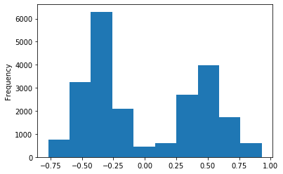


```python
df['nominate_dim1'].plot(kind="hist")
plt.title("Ideological Estimate of Sponsers")
plt.xlabel("More Democatic or Republican")
plt.ylabel("Number of Bills")
```


    Text(0, 0.5, 'Number of Bills')


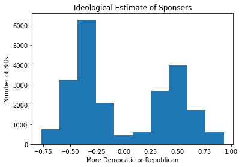


```python
df.Party = df.Party.fillna(328)
```


```python
df.Party = df.Party.astype(int)
```


```python
label = preprocessing.LabelEncoder()
df.Party = label.fit_transform(df.Party)
```


```python
df.Party.unique()
```


    array([0, 1, 2])


```python
#
plt.scatter(df.nominate_dim1, df.Party)
```


    <matplotlib.collections.PathCollection at 0x13d760be0>


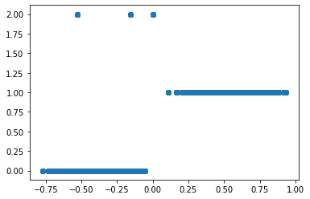


```python
#Member of Majority Party
df.Majority.value_counts().plot(kind='bar')
```


    <matplotlib.axes._subplots.AxesSubplot at 0x13d853748>


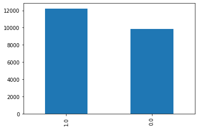


```python
#100=Dem
#200=Rep
#328=ISCPSR
df.Party.value_counts()
```


    0    12405
    1     9592
    2      423
    Name: Party, dtype: int64


```python
df.PLaw.value_counts().plot(x='Pass or Fail', kind='bar')
```


    <matplotlib.axes._subplots.AxesSubplot at 0x142e056a0>


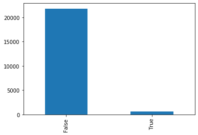


```python
df['PLaw'].value_counts().plot(kind="bar", title="test")
plt.title("Number of laws Pass vs Failed")
plt.xlabel("Pass or Fail")
plt.ylabel("Number of Bills")
```


    Text(0, 0.5, 'Number of Bills')


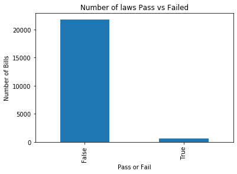


```python
df.Party.value_counts().plot(kind='bar')
```


    <matplotlib.axes._subplots.AxesSubplot at 0x13d954f98>


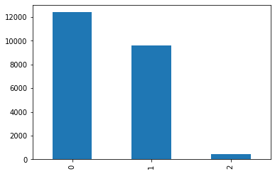


```python
# HR=House Bill
# S=Senate Bill
# HJRES=House Joint Resolution
# SJRES= Senate Joint Resoltion

df.BillType.value_counts()
```


    hr       14393
    s         7649
    hjres      235
    sjres      143
    Name: BillType, dtype: int64


```python
df.BillType.value_counts().plot(kind='bar')
```


    <matplotlib.axes._subplots.AxesSubplot at 0x13e9427b8>


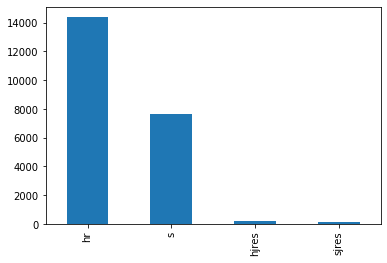


```python
#False or zero is House
#True or 1 is Senate
df.Chamber.value_counts()
```


    False    14628
    True      7792
    Name: Chamber, dtype: int64


```python
df.Chamber.value_counts().plot(kind='bar')
```


    <matplotlib.axes._subplots.AxesSubplot at 0x13ea20d30>


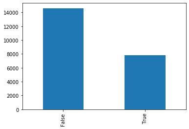


```python
#How many people Co-Sponsered bills
df.Cosponsr.value_counts()
```


    0      4202
    1      3892
    2      1900
    3      1636
    4      1111
           ... 
    279       1
    247       1
    215       1
    303       1
    383       1
    Name: Cosponsr, Length: 278, dtype: int64


```python
#Starts 1/03/17-5/22/20
len(df.IntrDate.unique())
```


    677


```python
#What Agenda the bill addresses(CodeBook)
#Top 5:
# 1. Health
# 2. Domestic Commerce
# 3. Civil Rights
# 4. Defense
# 5. Public Lands
df.Major.value_counts().plot(kind='bar')
```


    <matplotlib.axes._subplots.AxesSubplot at 0x13fac0ba8>


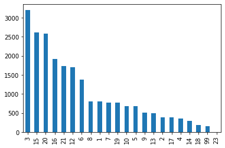


```python
#Number of Referals
df.MultNo.value_counts().plot(kind='bar')
```


    <matplotlib.axes._subplots.AxesSubplot at 0x13faeb978>


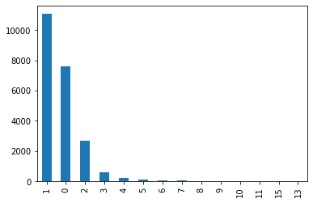


```python
# Pass House
df.PassH.value_counts().plot(kind='bar')
```


    <matplotlib.axes._subplots.AxesSubplot at 0x13feea588>


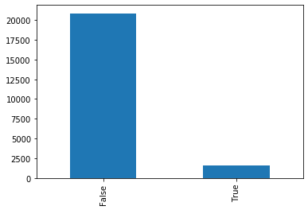


```python
#Pass Senate
df.PassS.value_counts().plot(kind='bar')
```


    <matplotlib.axes._subplots.AxesSubplot at 0x13fef2c88>


```python
df.Veto.value_counts()
```


    False    22413
    True         7
    Name: Veto, dtype: int64


## WordCloud with Title values


```python
#Remove Words from Title to get a better sense of what bills are in data
df['Title'] = df['Title'].str.replace(r'purposes', '')
df['Title'] = df['Title'].str.replace(r'bill', '')
df['Title'] = df['Title'].str.replace(r'amend', '')
df['Title'] = df['Title'].str.replace(r'title', '')
df['Title'] = df['Title'].str.replace(r'United', '')
df['Title'] = df['Title'].str.replace(r'States', '')
df['Title'] = df['Title'].str.replace(r'Act', '')
df['Title'] = df['Title'].str.replace(r'program', '')
df['Title'] = df['Title'].str.replace(r'Code', '')
df['Title'] = df['Title'].str.replace(r'certain', '')
df['Title'] = df['Title'].str.replace(r'improve', '')
df['Title'] = df['Title'].str.replace(r'provide', '')
df['Title'] = df['Title'].str.replace(r'establish', '')
df['Title'] = df['Title'].str.replace(r'prohibit', '')
df['Title'] = df['Title'].str.replace(r'service', '')
df['Title'] = df['Title'].str.replace(r'Federal', '')
df['Title'] = df['Title'].str.replace(r'Secretary', '')
df['Title'] = df['Title'].str.replace(r'Service', '')
df['Title'] = df['Title'].str.replace(r'use', '')
df['Title'] = df['Title'].str.replace(r'include', '')
df['Title'] = df['Title'].str.replace(r'require', '')
df['Title'] = df['Title'].str.replace(r'requirement', '')
df['Title'] = df['Title'].str.replace(r'ensure', '')
df['Title'] = df['Title'].str.replace(r'additional', '')
df['Title'] = df['Title'].str.replace(r'prohibit', '')
df['Title'] = df['Title'].str.replace(r'support', '')
df['Title'] = df['Title'].str.replace(r'care', '')
```


```python
#Creating word cloud 
df['Title'] = df['Title'].fillna("").astype('str')
title_corpus = ' '.join(df['Title'])
title_wordcloud = WordCloud(stopwords=STOPWORDS, background_color='red', height=2000, width=4000).generate(title_corpus)
```


```python
#Plotting WordCloud
plt.figure(figsize=(16,8))
plt.imshow(title_wordcloud)
plt.axis('off')
plt.show()
```


# Data Prep


```python
df = pd.read_csv('bills115-16partialAug92020.csv', encoding='latin1')
```


```python
#Remove unneeded columns
df.drop(columns = {'FrstConS', 'FrstConH','CumHServ', 
                   'CumSServ', 'Class','ComC', 'ComR', 
                   'BillNum', 'PLawDate', 'PLawNum', 
                   'NameFirst', 'NameLast', 'Minor',
                   'Private', 'ReportH', 'ReportS', 
                   'NameFull', 'BillID', 'Mref',
                   'PooleID', 'Postal', 'State', 'URL',
                   'ChRef', 'RankRef', 'SubChRef', 'SubRankRef',
                   'bioguide_id', 'Title', 'state_abbrev', 'District',
                   'DW1'}, axis=1, inplace=True)
```


```python
#First removing the '-' and quotations around Member ID so it can turn into a float. 
#Also Replace NA to digits
df['MemberID'] = df.MemberID.str.replace('-?' , '')
df['MemberID'] = df.MemberID.str.replace('NA?' , '00')
```


```python
#fill missing data with 3rd party and change datatype to int for model
df.Party = df.Party.fillna(328)
df.Party = df.Party.astype(int)
```


```python
# Using Label encoding to assign value to BillType and Party
label = preprocessing.LabelEncoder()
df.BillType = label.fit_transform(df.BillType)
df.Party = label.fit_transform(df.Party)
```


```python
# Using Label encoding to assign value to BillType
df.BillType.value_counts()
# 1=House Bill
# 2=Senate Bill
# 0=House Joint Resolution
# 3= Senate Joint Resoltion
```


    1    14393
    2     7649
    0      235
    3      143
    Name: BillType, dtype: int64


```python
#Changed string to fit in model
df['IntrDate'] = df.IntrDate.str.replace('/''?' , '')
```


```python
#Fill district code with none
df.district_code = df.district_code.fillna(0)
```


```python
#Fill State_icpsr with none
df.state_icpsr = df.state_icpsr.fillna(0)
```


```python
#Fill Majority with none
df.Majority = df.Majority.fillna(0)
```


```python
#Change majority to int 
df.Majority = df.Majority.astype(int)
```


```python
df.icpsr = df.icpsr.fillna(0)
df.icpsr = df.icpsr.astype(int)
```


```python
df.district_code = df.district_code.astype(int)
```


```python
df.state_icpsr=df.state_icpsr.astype(int)
```


```python
df.nominate_dim1 = df.nominate_dim1.fillna(0)
```


```python
df.nominate_dim1 = df
```


```python
df.nominate_dim1.unique()
```


    array([0, 1, 2, 3], dtype=object)


```python
df.dtypes
```


    BillType          int64
    Chamber            bool
    congress          int64
    Cosponsr          int64
    IntrDate         object
    Mult               bool
    MultNo            int64
    PLaw               bool
    desig             int64
    Veto               bool
    Delegate          int64
    Gender            int64
    MemberID         object
    Party             int64
    PassH              bool
    PassS              bool
    ImpBill           int64
    Majority          int64
    Major             int64
    icpsr             int64
    nominate_dim1    object
    district_code     int64
    state_icpsr       int64
    dtype: object


# Modeling

### Train Test Split


```python
#Creating Features and Target
X = df.drop(columns='PLaw')
y = df.PLaw
```

### Smote

To deal with the imbalance between bills that are passed and are not passed we will be using the smote method
to oversample out our data 


```python
#Train Test Split and Smote
X_train, X_test, y_train, y_test = train_test_split(X, y,test_size=0.25,random_state=27)
sm = SMOTE(sampling_strategy='auto', random_state=27)
X_train, y_train = sm.fit_sample(X_train, y_train)
```


## Baseline Model


```python
#Basic Dummy Classifier popularly used as a baseline model
dummy = DummyClassifier().fit(X_train, y_train)
dummy_pred = dummy.predict(X_test)
```


```python
# checking accuracy
print('Test Accuracy score: ', accuracy_score(y_test, dummy_pred))
# checking accuracy
print('Test Recall score: ', recall_score(y_test, dummy_pred))
#Checking f1
print('Test F1 score: ', f1_score(y_test, dummy_pred))
#Checking Percision
print('Test Precision score : ', precision_score(y_test, dummy_pred))
```

    Test Accuracy score:  0.49545049063336305
    Test Recall score:  0.4797297297297297
    Test F1 score:  0.04781144781144781
    Test Precision score :  0.025159461374911412


```python
plot_confusion_matrix(dummy, X_test, y_test)
plt.show()
```


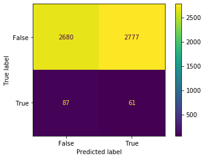


## Basic Logistic Regression

### MinMax Scaler


```python
X_train, X_test, y_train, y_test = train_test_split(X, y,test_size=0.25,random_state=27)
X_train, y_train = sm.fit_sample(X_train, y_train)
```


```python
scaler = MinMaxScaler(feature_range = (0,1))
scaler.fit(X_train)
X_train = scaler.transform(X_train)
X_test = scaler.transform(X_test)
```


```python
lr_clf = LogisticRegression()

lr_clf.fit(X_train, y_train)

y_pred_test = lr_clf.predict(X_test)

# checking accuracy
print('Test Accuracy score: ', accuracy_score(y_test, y_pred_test))
# checking accuracy
print('Test Recall score: ', recall_score(y_test, y_pred_test))
#Checking f1
print('Test F1 score: ', f1_score(y_test, y_pred_test))
#Checking precision
print('Test Precision score : ', precision_score(y_test, y_pred_test))
```

    Test Accuracy score:  0.9380909901873328
    Test Recall score:  1.0
    Test F1 score:  0.4603421461897356
    Test Precision score :  0.298989898989899


```python
param_grid = {
    'penalty': ['l2'],
    'C': [0.001,.009,0.01,.09,1,5,10,25],
    'fit_intercept': [True, False],
    'random_state' : [27],
}
```


```python
#Grid Search

grid_clf_acc = GridSearchCV(estimator = lr_clf , param_grid = param_grid, scoring = 'recall', 
                            n_jobs = -1, verbose = 1, iid = False, cv = 5)
grid_clf_acc.fit(X_train, y_train)

#Predict values based on new parameters
y_pred_acc = grid_clf_acc.predict(X_test)

# New Model Evaluation metrics 
print('Accuracy Score : ' + str(accuracy_score(y_test,y_pred_acc)))
print('Precision Score : ' + str(precision_score(y_test,y_pred_acc)))
print('Recall Score : ' + str(recall_score(y_test,y_pred_acc)))
print('F1 Score : ' + str(f1_score(y_test,y_pred_acc)))

#Logistic Regression (Grid Search) Confusion matrix
confusion_matrix(y_test,y_pred_acc)


```

    Accuracy Score : 0.9355932203389831
    Precision Score : 0.2907662082514735
    Recall Score : 1.0
    F1 Score : 0.4505327245053272


    array([[5096,  361],
           [   0,  148]])


```python
best_parameters = grid_clf_acc.best_params_
```


```python
best_parameters
```


    {'C': 0.009, 'fit_intercept': False, 'penalty': 'l2', 'random_state': 27}


```python
plot_confusion_matrix(lr_clf, X_test, y_test)  # doctest: +SKIP
plt.show()
```


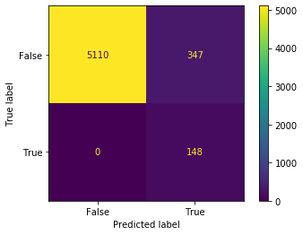


### StandardScaler


```python
X_train, X_test, y_train, y_test = train_test_split(X, y,test_size=0.25,random_state=27)
X_train, y_train = sm.fit_sample(X_train, y_train)
```


```python
scaler = StandardScaler()

scaler.fit(X_train)
X_train = scaler.transform(X_train)
X_test = scaler.transform(X_test)
```


```python
lr_clf = LogisticRegression(solver='liblinear')

lr_clf.fit(X_train, y_train)

y_pred_test = lr_clf.predict(X_test)

# checking accuracy
print('Test Accuracy score: ', accuracy_score(y_test, y_pred_test))
# checking accuracy
print('Test Recall score: ', recall_score(y_test, y_pred_test))
#Checking f1
print('Test F1 score: ', f1_score(y_test, y_pred_test))
#Checking Percision
print('Test Precision score : ', precision_score(y_test, y_pred_test))
```

    Test Accuracy score:  0.9384478144513827
    Test Recall score:  1.0
    Test F1 score:  0.4617784711388455
    Test Precision score :  0.3002028397565923


```python
param_grid = {
    'penalty': ['l2'],
    'C': [0.001,.009,0.01,.09,1,5,10,25],
    'fit_intercept': [True, False],
    'random_state' : [27],
}
```


```python
#Grid Search

grid_clf_acc = GridSearchCV(lr_clf, param_grid = param_grid, scoring = 'recall',
                            n_jobs = -1, verbose = 1, iid = False, cv = 5)
grid_clf_acc.fit(X_train, y_train)

#Predict values based on new parameters
y_pred_acc = grid_clf_acc.predict(X_test)

# New Model Evaluation metrics 
print('Accuracy Score : ' + str(accuracy_score(y_test,y_pred_acc)))
print('Precision Score : ' + str(precision_score(y_test,y_pred_acc)))
print('Recall Score : ' + str(recall_score(y_test,y_pred_acc)))
print('F1 Score : ' + str(f1_score(y_test,y_pred_acc)))

#Logistic Regression (Grid Search) Confusion matrix
confusion_matrix(y_test,y_pred_acc)
```


    Accuracy Score : 0.9350579839429081
    Precision Score : 0.2890625
    Recall Score : 1.0
    F1 Score : 0.4484848484848485


    array([[5093,  364],
           [   0,  148]])


```python
best_parameters = grid_clf_acc.best_params_
```


```python
best_parameters
```


    {'C': 0.001, 'fit_intercept': True, 'penalty': 'l2', 'random_state': 27}


```python
plot_confusion_matrix(lr_clf, X_test, y_test)
plt.show()
```


## KNeighbors Classifier

### MinMax Scaler


```python
X_train, X_test, y_train, y_test = train_test_split(X, y,test_size=0.25,random_state=27)
X_train, y_train = sm.fit_sample(X_train, y_train)
```


```python
scaler = StandardScaler()
scaler.fit(X_train)

X_train = scaler.transform(X_train)
X_test = scaler.transform(X_test)
```


```python
knn = KNeighborsClassifier()
knn.fit(X_train, y_train)

y_pred =knn.predict(X_test)

# checking accuracy
print('Test Accuracy score: ', accuracy_score(y_test, y_pred))
# checking accuracy
print('Test Recall score: ', recall_score(y_test, y_pred))
#Checking f1
print('Test F1 score: ', f1_score(y_test, y_pred))
#Checking Percision
print('Test Precision score : ', precision_score(y_test, y_pred))
```

    Test Accuracy score:  0.9587867975022302
    Test Recall score:  0.7702702702702703
    Test F1 score:  0.49673202614379086
    Test Precision score :  0.3665594855305466


```python
param_grid = {
    'n_neighbors': [1, 3, 5, 7, 9, 11, 13, 15],
    'weights': ['uniform', 'distance'],
    'algorithm': ['auto', 'ball_tree', 'kd_tree', 'brute'],
}
```


```python
#Grid Search

grid_clf_acc = GridSearchCV(knn, param_grid = param_grid, scoring = 'recall',
                           n_jobs = -1, verbose = 1, iid = False, cv = 5)
grid_clf_acc.fit(X_train, y_train)

#Predict values based on new parameters
y_pred_acc = grid_clf_acc.predict(X_test)

# New Model Evaluation metrics 
print('Accuracy Score : ' + str(accuracy_score(y_test,y_pred_acc)))
print('Precision Score : ' + str(precision_score(y_test,y_pred_acc)))
print('Recall Score : ' + str(recall_score(y_test,y_pred_acc)))
print('F1 Score : ' + str(f1_score(y_test,y_pred_acc)))

#(Grid Search) Confusion matrix
confusion_matrix(y_test,y_pred_acc)
```


    Accuracy Score : 0.9525423728813559
    Precision Score : 0.33879781420765026
    Recall Score : 0.8378378378378378
    F1 Score : 0.48249027237354086


    array([[5215,  242],
           [  24,  124]])


```python
best_parameters = grid_clf_acc.best_params_
```


```python
best_parameters
```


    {'algorithm': 'auto', 'n_neighbors': 9, 'weights': 'uniform'}


### Standard Scaler


```python
X_train, X_test, y_train, y_test = train_test_split(X, y,test_size=0.25,random_state=27)
X_train, y_train = sm.fit_sample(X_train, y_train)
```


```python
scaler = MinMaxScaler()
scaler.fit(X_train)

X_train = scaler.transform(X_train)
X_test = scaler.transform(X_test)
```


```python
knn = KNeighborsClassifier()
knn.fit(X_train, y_train)

y_pred =knn.predict(X_test)

# checking accuracy
print('Test Accuracy score: ', accuracy_score(y_test, y_pred))
# checking accuracy
print('Test Recall score: ', recall_score(y_test, y_pred))
#Checking f1
print('Test F1 score: ', f1_score(y_test, y_pred))
#Checking Percision
print('Test Precision score : ', precision_score(y_test, y_pred))
```

    Test Accuracy score:  0.9648528099910794
    Test Recall score:  0.7837837837837838
    Test F1 score:  0.5407925407925408
    Test Precision score :  0.4128113879003559


```python
param_grid = {
    'n_neighbors': [1, 3, 5, 7, 9, 11, 13, 15],
    'weights': ['uniform', 'distance'],
    'algorithm': ['auto', 'ball_tree', 'kd_tree', 'brute'],
}
```


```python
#Grid Search

grid_clf_acc = GridSearchCV(knn, param_grid = param_grid, scoring = 'recall',
                           n_jobs = -1, verbose = 1, iid = False, cv = 5)
grid_clf_acc.fit(X_train, y_train)

#Predict values based on new parameters
y_pred_acc = grid_clf_acc.predict(X_test)

# New Model Evaluation metrics 
print('Accuracy Score : ' + str(accuracy_score(y_test,y_pred_acc)))
print('Precision Score : ' + str(precision_score(y_test,y_pred_acc)))
print('Recall Score : ' + str(recall_score(y_test,y_pred_acc)))
print('F1 Score : ' + str(f1_score(y_test,y_pred_acc)))

#(Grid Search) Confusion matrix
confusion_matrix(y_test,y_pred_acc)
```


    Accuracy Score : 0.959678858162355
    Precision Score : 0.378125
    Recall Score : 0.8175675675675675
    F1 Score : 0.5170940170940171


    array([[5258,  199],
           [  27,  121]])


```python
best_parameters = grid_clf_acc.best_params_
```


```python
best_parameters
```


    {'algorithm': 'auto', 'n_neighbors': 11, 'weights': 'distance'}


```python
k_scores = []

k_range = list(range(1, 12))
for k in k_range:
    knn = KNeighborsClassifier(n_neighbors=k)
    knn.fit(X_train, y_train)
    
    y_pred = knn.predict(X_test)
    
    test_f1 = f1_score(y_test, y_pred)
    
    k_scores.append(test_f1)
    print(k_scores)
```

    [0.5308641975308642]
    [0.5308641975308642, 0.5396825396825397]
    [0.5308641975308642, 0.5396825396825397, 0.5604113110539846]
    [0.5308641975308642, 0.5396825396825397, 0.5604113110539846, 0.5578947368421053]
    [0.5308641975308642, 0.5396825396825397, 0.5604113110539846, 0.5578947368421053, 0.5407925407925408]
    [0.5308641975308642, 0.5396825396825397, 0.5604113110539846, 0.5578947368421053, 0.5407925407925408, 0.5510688836104513]
    [0.5308641975308642, 0.5396825396825397, 0.5604113110539846, 0.5578947368421053, 0.5407925407925408, 0.5510688836104513, 0.5053995680345573]
    [0.5308641975308642, 0.5396825396825397, 0.5604113110539846, 0.5578947368421053, 0.5407925407925408, 0.5510688836104513, 0.5053995680345573, 0.5154185022026432]
    [0.5308641975308642, 0.5396825396825397, 0.5604113110539846, 0.5578947368421053, 0.5407925407925408, 0.5510688836104513, 0.5053995680345573, 0.5154185022026432, 0.5093167701863355]
    [0.5308641975308642, 0.5396825396825397, 0.5604113110539846, 0.5578947368421053, 0.5407925407925408, 0.5510688836104513, 0.5053995680345573, 0.5154185022026432, 0.5093167701863355, 0.5189873417721519]
    [0.5308641975308642, 0.5396825396825397, 0.5604113110539846, 0.5578947368421053, 0.5407925407925408, 0.5510688836104513, 0.5053995680345573, 0.5154185022026432, 0.5093167701863355, 0.5189873417721519, 0.49411764705882344]


```python
plt.figure(figsize=(12, 6))  
plt.plot(k_range, k_scores, color='red', linestyle='dashed', marker='o',  
         markerfacecolor='blue', markersize=10)
plt.title('Accuracy score by K Value')  
plt.xlabel('K Value')  
plt.ylabel('Accuracy Score') 
plt.show()
```


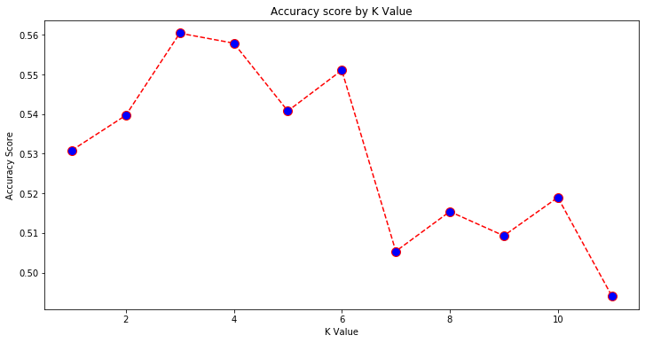


## Bagging

### Min Man Scaler


```python
X_train, X_test, y_train, y_test = train_test_split(X, y,test_size=0.25,random_state=27)
X_train, y_train = sm.fit_sample(X_train, y_train)
```


```python
scaler = StandardScaler()
scaler.fit(X_train)

X_train = scaler.transform(X_train)
X_test = scaler.transform(X_test)
```


```python
bag = BaggingClassifier(random_state=27)
bag.fit(X_train, y_train)

y_pred =bag.predict(X_test)

# checking accuracy
print('Test Accuracy score: ', accuracy_score(y_test, y_pred))
# checking accuracy
print('Test Recall score: ', recall_score(y_test, y_pred))
#Checking f1
print('Test F1 score: ', f1_score(y_test, y_pred))
#Checking Percision
print('Test Precision score : ', precision_score(y_test, y_pred))
```

    Test Accuracy score:  0.9785905441570026
    Test Recall score:  0.5405405405405406
    Test F1 score:  0.5714285714285714
    Test Precision score :  0.6060606060606061


```python
plot_confusion_matrix(bag, X_test, y_test)  
plt.show()
```


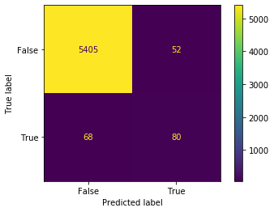


```python
plot_confusion_matrix(lr_clf, X_test, y_test)  # doctest: +SKIP
plt.show()
```


```python
param_grid = {'n_estimators': (1, 3, 5, 7, 9, 11),
              'oob_score' : (True, False),
              'max_samples' : (50, 100, 150, 200),
              'max_features' : (10, 15, 20, 25, 30),
              'bootstrap_features' : (True, False)
              }
```


```python
#Grid Search

grid_clf_acc = GridSearchCV(bag, param_grid = param_grid, scoring = 'recall',
                           n_jobs = -1, verbose = 1, iid = False, cv = 5)
grid_clf_acc.fit(X_train, y_train)

#Predict values based on new parameters
y_pred_acc = grid_clf_acc.predict(X_test)

# New Model Evaluation metrics 
print('Accuracy Score : ' + str(accuracy_score(y_test,y_pred_acc)))
print('Precision Score : ' + str(precision_score(y_test,y_pred_acc)))
print('Recall Score : ' + str(recall_score(y_test,y_pred_acc)))
print('F1 Score : ' + str(f1_score(y_test,y_pred_acc)))

#(Grid Search) Confusion matrix
confusion_matrix(y_test,y_pred_acc)
```


    Accuracy Score : 0.9371989295272078
    Precision Score : 0.296
    Recall Score : 1.0
    F1 Score : 0.4567901234567901


    array([[5105,  352],
           [   0,  148]])


```python
best_parameters = grid_clf_acc.best_params_
```


```python
best_parameters
```


    {'bootstrap_features': False,
     'max_features': 20,
     'max_samples': 50,
     'n_estimators': 11,
     'oob_score': True}


### Standard Scaler


```python
X_train, X_test, y_train, y_test = train_test_split(X, y,test_size=0.25,random_state=27)
X_train, y_train = sm.fit_sample(X_train, y_train)
```


```python
scaler = MinMaxScaler()
scaler.fit(X_train)

X_train = scaler.transform(X_train)
X_test = scaler.transform(X_test)
```


```python
bag = BaggingClassifier(random_state=27)
bag.fit(X_train, y_train)

y_pred =bag.predict(X_test)

# checking accuracy
print('Test Accuracy score: ', accuracy_score(y_test, y_pred))
# checking accuracy
print('Test Recall score: ', recall_score(y_test, y_pred))
#Checking f1
print('Test F1 score: ', f1_score(y_test, y_pred))
#Checking Percision
print('Test Precision score : ', precision_score(y_test, y_pred))
```

    Test Accuracy score:  0.9780553077609278
    Test Recall score:  0.527027027027027
    Test F1 score:  0.5591397849462365
    Test Precision score :  0.5954198473282443


```python
param_grid = {'n_estimators': (1, 3, 5, 7, 9, 11),
              'oob_score' : (True, False),
              'max_samples' : (50, 100, 150, 200),
              'max_features' : (10, 15, 20, 25, 30),
              'bootstrap_features' : (True, False)
              }
```


```python
#Grid Search

grid_clf_acc = GridSearchCV(bag, param_grid = param_grid, scoring = 'recall',
                           n_jobs = -1, verbose = 1, iid = False, cv = 5)
grid_clf_acc.fit(X_train, y_train)

#Predict values based on new parameters
y_pred_acc = grid_clf_acc.predict(X_test)

# New Model Evaluation metrics 
print('Accuracy Score : ' + str(accuracy_score(y_test,y_pred_acc)))
print('Precision Score : ' + str(precision_score(y_test,y_pred_acc)))
print('Recall Score : ' + str(recall_score(y_test,y_pred_acc)))
print('F1 Score : ' + str(f1_score(y_test,y_pred_acc)))

#(Grid Search) Confusion matrix
confusion_matrix(y_test,y_pred_acc)
```


    Accuracy Score : 0.9370205173951829
    Precision Score : 0.2954091816367265
    Recall Score : 1.0
    F1 Score : 0.45608628659476114


    array([[5104,  353],
           [   0,  148]])


```python
best_parameters = grid_clf_acc.best_params_
```


```python
best_parameters
```


    {'bootstrap_features': False,
     'max_features': 20,
     'max_samples': 50,
     'n_estimators': 11,
     'oob_score': True}


## XGBOOST

### MinMax Scaler


```python
X_train, X_test, y_train, y_test = train_test_split(X, y,test_size=0.25,random_state=27)
X_train, y_train = sm.fit_sample(X_train, y_train)
```


```python
scaler = MinMaxScaler()
scaler.fit(X_train)

X_train = scaler.transform(X_train)
X_test = scaler.transform(X_test)
```


```python
clf_xgb = xgb.XGBClassifier(objective = 'binary:logistic')
clf_xgb.fit(X_train, y_train)

y_pred =clf_xgb.predict(X_test)

# checking accuracy
print('Test Accuracy score: ', accuracy_score(y_test, y_pred))
# checking accuracy
print('Test Recall score: ', recall_score(y_test, y_pred))
#Checking f1
print('Test F1 score: ', f1_score(y_test, y_pred))
#Checking Percision
print('Test Precision score : ', precision_score(y_test, y_pred))
```

    Test Accuracy score:  0.9668153434433542
    Test Recall score:  0.7027027027027027
    Test F1 score:  0.5279187817258884
    Test Precision score :  0.42276422764227645


```python
param_dist = {'max_depth': (1, 3, 5, 7, 9),
              'learning_rate': (0.1, .25, .5, .75),
              'n_estimators': (50, 100., 150, 200),
              'booster': ('gbtree', 'gblinear', 'dart'),
              'min_child_weight':(1, 3, 5, 7, 9),
              'random_state' : (27)}


```


```python
#Grid Search

grid_clf_acc = GridSearchCV(clf_xgb, param_grid = param_grid, scoring = 'recall',
                           n_jobs = -1, verbose = 1, iid = False, cv = 5)
grid_clf_acc.fit(X_train, y_train)

#Predict values based on new parameters
y_pred_acc = grid_clf_acc.predict(X_test)

# New Model Evaluation metrics 
print('Accuracy Score : ' + str(accuracy_score(y_test,y_pred_acc)))
print('Precision Score : ' + str(precision_score(y_test,y_pred_acc)))
print('Recall Score : ' + str(recall_score(y_test,y_pred_acc)))
print('F1 Score : ' + str(f1_score(y_test,y_pred_acc)))

#(Grid Search) Confusion matrix
confusion_matrix(y_test,y_pred_acc)
```


    Accuracy Score : 0.9384478144513827
    Precision Score : 0.2985685071574642
    Recall Score : 0.9864864864864865
    F1 Score : 0.4583987441130297


    array([[5114,  343],
           [   2,  146]])


```python
best_parameters = grid_clf_acc.best_params_
```


```python
best_parameters
```


    {'bootstrap_features': True,
     'max_features': 10,
     'max_samples': 50,
     'n_estimators': 9,
     'oob_score': True}


### Standard


```python
X_train, X_test, y_train, y_test = train_test_split(X, y,test_size=0.25,random_state=27)
X_train, y_train = sm.fit_sample(X_train, y_train)
```


```python
clf_xgb = xgb.XGBClassifier(objective = 'binary:logistic')
```


```python
scaler = StandardScaler()
scaler.fit(X_train)

X_train = scaler.transform(X_train)
X_test = scaler.transform(X_test)
```


```python
clf_xgb = xgb.XGBClassifier(objective = 'binary:logistic')
clf_xgb.fit(X_train, y_train)

y_pred =clf_xgb.predict(X_test)

# checking accuracy
print('Test Accuracy score: ', accuracy_score(y_test, y_pred))
# checking accuracy
print('Test Recall score: ', recall_score(y_test, y_pred))
#Checking f1
print('Test F1 score: ', f1_score(y_test, y_pred))
#Checking Percision
print('Test Precision score : ', precision_score(y_test, y_pred))
```

    Test Accuracy score:  0.9671721677074041
    Test Recall score:  0.7094594594594594
    Test F1 score:  0.5329949238578681
    Test Precision score :  0.4268292682926829


```python
param_dist = {'max_depth': (1, 3, 5, 7, 9),
              'learning_rate': (0.1, .25, .5, .75),
              'n_estimators': (50, 100., 150, 200),
              'booster': ('gbtree', 'gblinear', 'dart'),
              'min_child_weight':(1, 3, 5, 7, 9),
              'random_state' : (27)}


```


```python
#Grid Search

grid_clf_acc = GridSearchCV(clf_xgb, param_grid = param_grid, scoring = 'recall',
                           n_jobs = -1, verbose = 1, iid = False, cv = 5)
grid_clf_acc.fit(X_train, y_train)

#Predict values based on new parameters
y_pred_acc = grid_clf_acc.predict(X_test)

# New Model Evaluation metrics 
print('Accuracy Score : ' + str(accuracy_score(y_test,y_pred_acc)))
print('Precision Score : ' + str(precision_score(y_test,y_pred_acc)))
print('Recall Score : ' + str(recall_score(y_test,y_pred_acc)))
print('F1 Score : ' + str(f1_score(y_test,y_pred_acc)))

#(Grid Search) Confusion matrix
confusion_matrix(y_test,y_pred_acc)
```


    Accuracy Score : 0.9384478144513827
    Precision Score : 0.2985685071574642
    Recall Score : 0.9864864864864865
    F1 Score : 0.4583987441130297


    array([[5114,  343],
           [   2,  146]])


```python
best_parameters = grid_clf_acc.best_params_
```


```python
best_parameters
```


    {'bootstrap_features': True,
     'max_features': 10,
     'max_samples': 50,
     'n_estimators': 9,
     'oob_score': True}


## Random Forrest

### MinMax Scaler


```python
X_train, X_test, y_train, y_test = train_test_split(X, y,test_size=0.25,random_state=27)
X_train, y_train = sm.fit_sample(X_train, y_train)
```


```python
scaler = MinMaxScaler()
scaler.fit(X_train)

X_train = scaler.transform(X_train)
X_test = scaler.transform(X_test)
```


```python
clf_cv = RandomForestClassifier(random_state=27)
clf_cv.fit(X_train, y_train)


y_pred = clf_cv.predict(X_test)

# checking accuracy
print('Test Accuracy score: ', accuracy_score(y_test, y_pred))
# checking accuracy
print('Test Recall score: ', recall_score(y_test, y_pred))
#Checking f1
print('Test F1 score: ', f1_score(y_test, y_pred))
#Checking Percision
print('Test Precision score : ', precision_score(y_test, y_pred))
```

    Test Accuracy score:  0.9782337198929527
    Test Recall score:  0.5135135135135135
    Test F1 score:  0.5547445255474451
    Test Precision score :  0.6031746031746031


```python
param_grid = {'n_estimators': (100, 150, 200, 250),
              'criterion': ('gini', 'entropy'),
              'min_samples_split': (2, 4, 6, 8),
              'max_features': ('auto', 'sqrt', 'log2'),
             'bootstrap' : (True, False)}
```


```python
#Grid Search

grid_clf_acc = GridSearchCV(clf_cv, param_grid = param_grid, scoring = 'recall',
                           n_jobs = -1, verbose = 1, iid = False, cv = 5)
grid_clf_acc.fit(X_train, y_train)

#Predict values based on new parameters
y_pred_acc = grid_clf_acc.predict(X_test)

# New Model Evaluation metrics 
print('Accuracy Score : ' + str(accuracy_score(y_test,y_pred_acc)))
print('Precision Score : ' + str(precision_score(y_test,y_pred_acc)))
print('Recall Score : ' + str(recall_score(y_test,y_pred_acc)))
print('F1 Score : ' + str(f1_score(y_test,y_pred_acc)))

#(Grid Search) Confusion matrix
confusion_matrix(y_test,y_pred_acc)
```


    Accuracy Score : 0.9789473684210527
    Precision Score : 0.6209677419354839
    Recall Score : 0.5202702702702703
    F1 Score : 0.5661764705882353


    array([[5410,   47],
           [  71,   77]])


```python
best_parameters = grid_clf_acc.best_params_
```


```python
best_parameters
```


    {'bootstrap': True,
     'criterion': 'entropy',
     'max_features': 'auto',
     'min_samples_split': 2,
     'n_estimators': 200}


### Standard Scaler


```python
X_train, X_test, y_train, y_test = train_test_split(X, y,test_size=0.25,random_state=27)
X_train, y_train = sm.fit_sample(X_train, y_train)
```


```python
scaler = StandardScaler()
scaler.fit(X_train)

X_train = scaler.transform(X_train)
X_test = scaler.transform(X_test)
```


```python
clf_cv = RandomForestClassifier(random_state=27)
clf_cv.fit(X_train, y_train)


y_pred = clf_cv.predict(X_test)

# checking accuracy
print('Test Accuracy score: ', accuracy_score(y_test, y_pred))
# checking accuracy
print('Test Recall score: ', recall_score(y_test, y_pred))
#Checking f1
print('Test F1 score: ', f1_score(y_test, y_pred))
#Checking Percision
print('Test Precision score : ', precision_score(y_test, y_pred))
```

    Test Accuracy score:  0.9778768956289028
    Test Recall score:  0.5
    Test F1 score:  0.5441176470588236
    Test Precision score :  0.5967741935483871


```python
param_grid = {'n_estimators': (100, 150, 200, 250),
              'criterion': ('gini', 'entropy'),
              'min_samples_split': (2, 4, 6, 8),
              'max_features': ('auto', 'sqrt', 'log2'),
             'bootstrap' : (True, False)}
```


```python
#Grid Search

grid_clf_acc = GridSearchCV(clf_cv, param_grid = param_grid, scoring = 'recall',
                           n_jobs = -1, verbose = 1, iid = False, cv = 5)
grid_clf_acc.fit(X_train, y_train)

#Predict values based on new parameters
y_pred_acc = grid_clf_acc.predict(X_test)

# New Model Evaluation metrics 
print('Accuracy Score : ' + str(accuracy_score(y_test,y_pred_acc)))
print('Precision Score : ' + str(precision_score(y_test,y_pred_acc)))
print('Recall Score : ' + str(recall_score(y_test,y_pred_acc)))
print('F1 Score : ' + str(f1_score(y_test,y_pred_acc)))

#(Grid Search) Confusion matrix
confusion_matrix(y_test,y_pred_acc)
```


    Accuracy Score : 0.9780553077609278
    Precision Score : 0.5968992248062015
    Recall Score : 0.5202702702702703
    F1 Score : 0.5559566787003609


    array([[5405,   52],
           [  71,   77]])


```python
best_parameters = grid_clf_acc.best_params_
```


```python
best_parameters
```


    {'bootstrap': True,
     'criterion': 'entropy',
     'max_features': 'auto',
     'min_samples_split': 2,
     'n_estimators': 150}


```python

```
